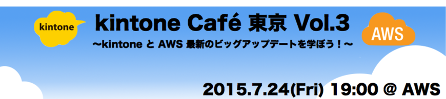
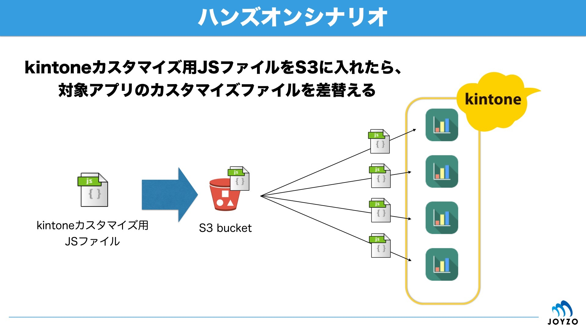

## Contents
* **kintone-Cafe-Tokyo-3-pack.zip**：「顧客リスト」アプリのテンプレート（パック）です。同一フォーム・同一カスタマイズ（`sample.js`）のアプリが4つパッケージングされています。

* **sample_data.csv**：「顧客リスト」アプリに読み込めるサンプルデータです。

* **./clientjs**：kintoneカスタマイズ用のJSファイルです。`sample.js`はハンズオンの際の差替用ファイルです。`kintone-Cafe-Tokyo-2-pack.zip`に現状内包されているものは別物です。

* **./nodejs**：Node.jsでkintoneのREST APIをコールするサンプルや、Lamda関数のサンプルのファイルが内包されています。

* **./nodejs/kintone_get.js**：Node.jsでkintoneのREST API（records/GET）をコールするサンプルです。

* **./nodejs/kintone_post.js**：Node.jsでkintoneのREST API（record/POST）をコールするサンプルです。

* **./nodejs/kintone_upload.js**：Node.jsでkintoneのREST API（file/POST）をコールするサンプルです。

* **./nodejs/index.js**：S3にkintone-JSカスタマイズファイルがPUTされたら、対象アプリ（1つ）のカスタマイズファイルを更新するLambda関数サンプルです。

* **./nodejs/multi.js**：S3にkintone-JSカスタマイズファイルがPUTされたら、対象アプリ（複数）のカスタマイズファイルを更新するLambda関数サンプルです（ハンズオン後追加）。

* **./nodejs/node_modules**：Node.jsのモジュールで「request」、「fs」、「async」を内包しています（ハンズオン後asyncを追加）。



## Excute Node.js samples
```
$ node kintone_get.js
```
Node.jsでkintoneのREST API（records/GET）をコールするサンプルの実行コマンド例です。

## Packaging Lambda files
```
$ zip -r sample.zip index.js node_modules
```
Lambda関数ファイルのZIPファイルパッケージングのコマンド例です。

## Reference
* [AWSを活用したkintone開発](http://www.slideshare.net/yamaryu0508b/kintone-caf-vol3-kintone-aws-lambdas3-50828655)（slideshare）
* [Amazon Web Services](http://aws.amazon.com/jp/)
* [kintone](https://kintone.cybozu.com/jp/)
* [kintone API リファレンス](https://cybozudev.zendesk.com/hc/ja/categories/200147600)（cybozu.com developer network内）
* [kintoneアプリ作成系API リファレンス](https://cybozudev.zendesk.com/hc/ja/articles/204693590)（cybozu.com developer network内）
* [kintone JavaScript APIサンプル](https://cybozudev.zendesk.com/hc/ja/sections/200263970)（cybozu.com developer network内）
* [AWS利用無料枠](http://aws.amazon.com/jp/free/)（[FAQ](http://aws.amazon.com/jp/free/faqs/)）
* [kintone30日間無料お試し](https://kintone.cybozu.com/jp/trial/)
* [kintone無償開発者ライセンス](https://cybozudev.zendesk.com/hc/ja/articles/200720464)
